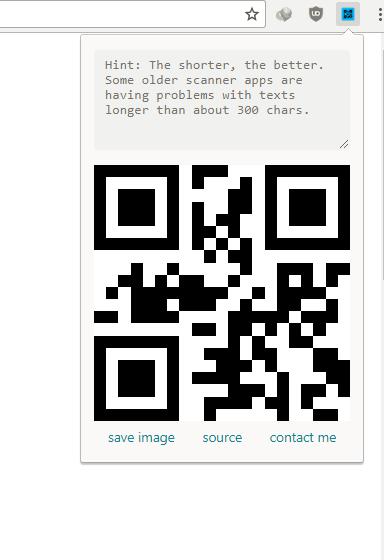
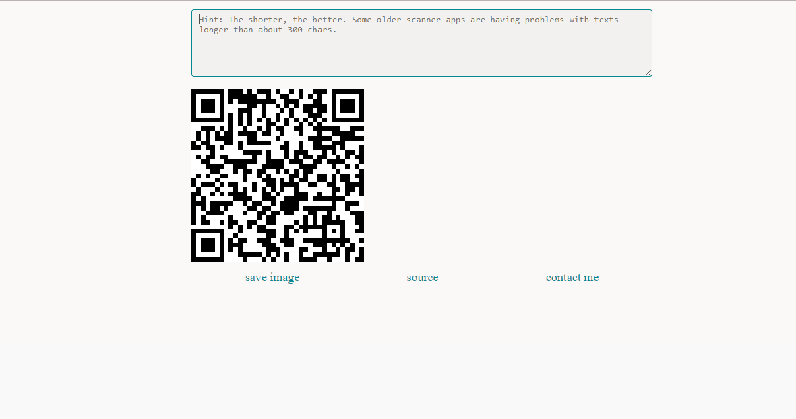

# QR-Code-Generator 
Generate fast and simple QR codes for sharing. Download the extension [here](https://github.com/shubhamnishad97/QR-Code-Generator/raw/master/QR%20Code%20Generator.crx)

Although this a chrome extension but a web version using the same code is hosted on Github Pages for a quick look. https://shubhamnishad97.github.io/QR-Code-Generator/

I wanted to learn to make extensions from the first time I used one. This extension acted as the perfect idea and hence it was born.
This is one part of my QRCode sharing project. The other part is located [here](https://github.com/shubhamnishad97/ScanBarcode-QRcode).

## Features:

*   Standalone QRcode generation (doesn't depend on external services). 
*   Option to save the generated code as image on local machine.
*   Simple and Intuitive design.

            
      
      
 

## Resources/Packages used

- [jQuery](https://jquery.com/)
- [jquery.qrcode plugin](https://github.com/jeromeetienne/jquery-qrcode) by [jeromeetienne](https://github.com/jeromeetienne)
- [sakura-css](https://github.com/oxalorg/sakura): a minimal css framework

## How to run the project
Download the extension [here](https://github.com/shubhamnishad97/QR-Code-Generator/raw/master/QR%20Code%20Generator.crx)

OR

Use the web version [here](https://github.com/shubhamnishad97/ScanBarcode-QRcode)

OR 

Download or clone the repo and use the `index.html` file.

## Todo

- publishing on the chrome store
- adding option to use the extension by right-click action
- adding more customization options like background color

## License [MIT](https://github.com/shubhamnishad97/QR-Code-Generator/blob/master/LICENSE)
